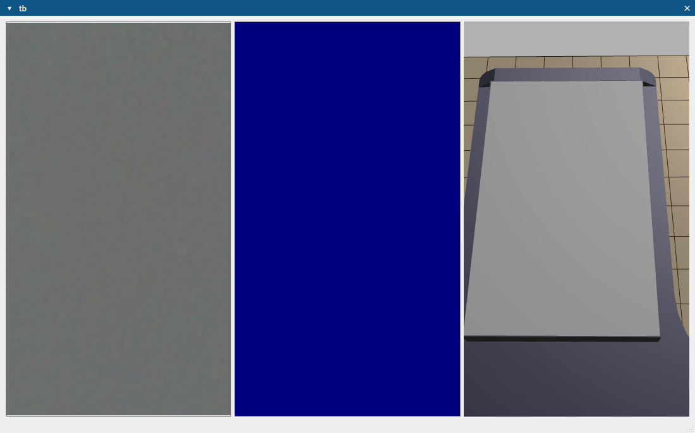
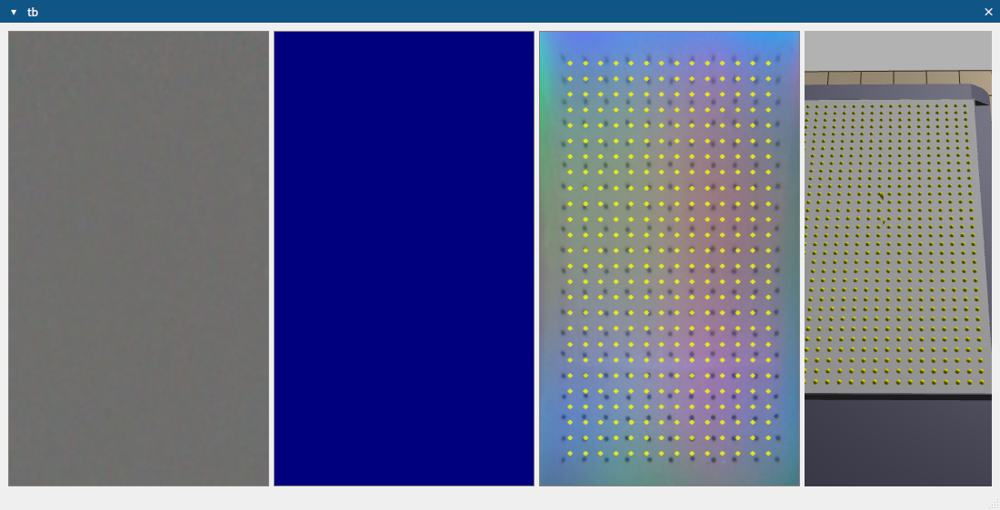
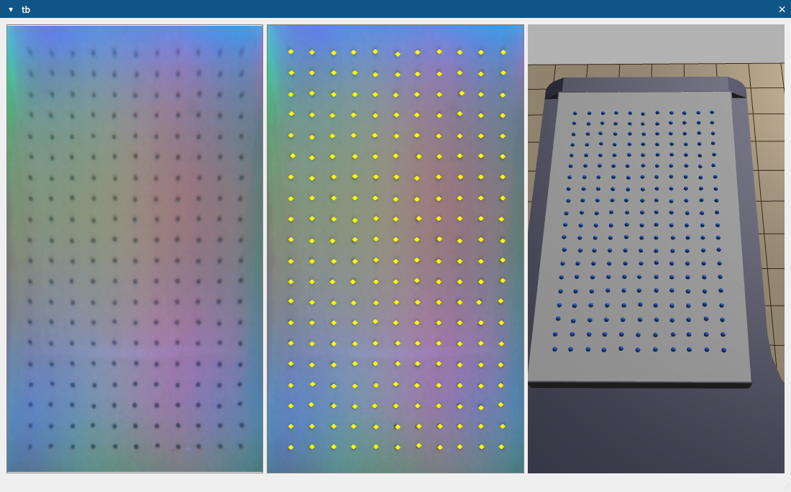

# 千觉 Xense SDK
## 1. download 
```
git clone -b dev https://github.com/ChangerC77/xensesdk.git
```
## 2. conda
### 进入 Xense SDK 目录
```
cd ~/xensesdk
```
### 创建并激活虚拟环境
```
conda create -n xenseenv python=3.9.19
conda activate xenseenv
```
## 3. 根据对应显卡安装显卡驱动
## 4. cuda & cudnn
SDK 支持 `CUDA Toolkit 11.8` 和 `cuDNN 8.9.2.26`。根据您的环境，选择以下安装方式：
### 1. 通过 Conda 直接安装 (recommand)
1. 搜索所需版本：
```
conda search cudnn
conda search cudatoolkit
```
2. 安装所需版本：
```
conda install cudnn==8.9.2.26 cudatoolkit==11.8.0
```
耗时比较长
```
Channels:
 - defaults
Platform: linux-64
Collecting package metadata (repodata.json): done
Solving environment: done


==> WARNING: A newer version of conda exists. <==
    current version: 25.3.1
    latest version: 25.5.0

Please update conda by running

    $ conda update -n base -c defaults conda


## Package Plan ##

  environment location: /home/tars/system/miniconda3/envs/xenseenv

  added / updated specs:
    - cudatoolkit==11.8.0
    - cudnn==8.9.2.26


The following packages will be downloaded:

    package                    |            build
    ---------------------------|-----------------
    cudatoolkit-11.8.0         |       h6a678d5_0       630.7 MB
    cudnn-8.9.2.26             |         cuda11_0       469.4 MB
    ------------------------------------------------------------
                                           Total:        1.07 GB

The following NEW packages will be INSTALLED:

  cudatoolkit        pkgs/main/linux-64::cudatoolkit-11.8.0-h6a678d5_0 
  cudnn              pkgs/main/linux-64::cudnn-8.9.2.26-cuda11_0 


Proceed ([y]/n)? y


Downloading and Extracting Packages:
                                                                                                     
Preparing transaction: done                                                                          
Verifying transaction: done
Executing transaction: \ By downloading and using the CUDA Toolkit conda packages, you accept the terms and conditions of the CUDA End User License Agreement (EULA): https://docs.nvidia.com/cuda/eula/index.html

done
```
### 2. 从本地 Conda 环境包安装
```
conda install --use-local cudatoolkit-11.8.0-hd77b12b_0.conda
conda install --use-local cudnn-8.9.2.26-cuda11_0.conda
```
## 5. install Xense SDK
将 SDK 包安装到您的环境中, `whl`文件已经集成到仓库中
```
pip install xensesdk-1.2.2-cp39-cp39-linux_x86_64.whl
```
output
```
Installing collected packages: PyOpenGL, mpmath, flatbuffers, assimp-py, sympy, shiboken6, pyzmq, PyYAML, pyudev, pycparser, psutil, protobuf, pillow, packaging, numpy, lz4, humanfriendly, cython, av, scipy, qtpy, PySide6-Essentials, opencv-python, h5py, cypack, coloredlogs, cffi, PySide6-Addons, onnxruntime-gpu, cryptography, PySide6, xensesdk
Successfully installed PyOpenGL-3.1.7 PySide6-6.9.1 PySide6-Addons-6.9.1 PySide6-Essentials-6.9.1 PyYAML-6.0.2 assimp-py-1.0.7 av-13.1.0 cffi-1.17.1 coloredlogs-15.0.1 cryptography-43.0.3 cypack-0.0.2.dev5 cython-3.1.1 flatbuffers-25.2.10 h5py-3.13.0 humanfriendly-10.0 lz4-4.4.4 mpmath-1.3.0 numpy-1.26.4 onnxruntime-gpu-1.18.0 opencv-python-4.10.0.84 packaging-25.0 pillow-10.2.0 protobuf-6.31.1 psutil-7.0.0 pycparser-2.22 pyudev-0.24.3 pyzmq-24.0.1 qtpy-2.4.3 scipy-1.13.1 shiboken6-6.9.1 sympy-1.14.0 xensesdk-1.2.2
```
## 6. sensor config
使用前见获得对应传感器配置文件，文件和传感器型号一一对应
目前使用传感器型号为`OG000027`和`OG000046`
## 7. code
可以在以下目录中查找示例源代码：
```
python -m site
```
找到自己对应的conda环境路径
```
cd ~/system/miniconda3/envs/xenseenv/lib/python3.9/site-packages/xensesdk/examples
```
### 1. get info from sensor
```
cd ~/xensesdk
python get_info.py
```
### 2. example_finger_depth.py
```
cd ~/xensesdk
python example_finger_depth.py
```
output
```
Found Xense devices: {'OG000046': 0}
In SDK: [Network] Camera 0 connected
init infer engine
infer session using GPU
/home/tars/xensesdk/example_finger_depth.py:8: DeprecationWarning: Enum value 'Qt::ApplicationAttribute.AA_EnableHighDpiScaling' is marked as deprecated, please check the documentation for more information.
  View = ExampleView(sensor_0)
```


### 3. example_depth.py
```
cd ~/xensesdk
python example_depth.py
```
output
```
Found Xense devices: {'OG000046': 0}
In SDK: [Network] Camera 0 connected
init infer engine
infer session using GPU
/home/tars/xensesdk/example_depth.py:8: DeprecationWarning: Enum value 'Qt::ApplicationAttribute.AA_EnableHighDpiScaling' is marked as deprecated, please check the documentation for more information.
  View = ExampleView(sensor_0)
```


### 4. example_force.py
```
cd ~/xensesdk
python example_force.py
```
output
```
Found Xense devices: {'OG000046': 0}
In SDK: [Network] Camera 0 connected
init infer engine
infer session using GPU
/home/tars/xensesdk/example_force.py:8: DeprecationWarning: Enum value 'Qt::ApplicationAttribute.AA_EnableHighDpiScaling' is marked as deprecated, please check the documentation for more information.
  View = ExampleView(sensor_0)
```


### 5. example_marker_detect.py
```
cd ~/xensesdk
python example_marker_detect.py
```
output
```
Found Xense devices: {'OG000046': 0}
In SDK: [Network] Camera 0 connected
init infer engine
infer session using GPU
/home/tars/xensesdk/example_marker_detect.py:8: DeprecationWarning: Enum value 'Qt::ApplicationAttribute.AA_EnableHighDpiScaling' is marked as deprecated, please check the documentation for more information.
  View = ExampleView(sensor_0)
```


### 6. example_record_data.py
```
cd ~/xensesdk
example_record_data.py
```
### 7. example_data_processing.py
```
cd ~/xensesdk
python example_data_processing.py
```

# API 文档

本文件提供了用于处理传感器图像的各类方法，包含深度图生成、差异图计算、标记检测以及传感器数据的综合聚合。

---

## 1. `create` 方法

### 描述

创建一个传感器实例，在结束时请调用`release`。

### 输入参数

* **cam\_id** (`int | str`, 可选): 传感器 ID、序列号或视频路径。默认为 0。
* **use\_gpu** (`bool`, 可选): 是否使用 GPU 推理，默认为 True。
* **config\_path** (`str | Path`, 可选): 配置文件路径或目录。如果是目录，需包含与传感器序列号同名的标定文件。
* **api** (`Enum`, 可选): 相机 API 类型（如 OpenCV 后端），用于指定相机访问方式。
* **check\_serial** (`bool`, 可选): 是否检查传感器序列号，默认 True。
* **rectify\_size** (`tuple[int, int]`, 可选): 校正图像尺寸。
* **ip\_address** (`str`, 可选): 远程连接使用的相机 IP。
* **video\_path** (`str`, 可选): 离线模拟的视频路径。

### 返回

* `Sensor` 对象

### 示例

```python

# Example 1：  用SN码开启
from xensesdk import Sensor
sensor = Sensor.create('OP000064') 

# Example 2：  用相机编号开启
sensor = Sensor.create(0) 

# Example 3： 打开储存的数据
sensor = Sensor.create(None, video_path=r"data.h5")

# Example 4： 打开算力板上的传感器
sensor =  Sensor.create('OP000064', ip_address="192.168.66.66")
```
### 若不确定传感器型号，可通过以下代码获得
```
from xensesdk.xenseInterface.XenseSensor import Sensor
sensor = Sensor.create(0, config_path = 'config/') # config_path 是配置文件的路径，config_path下需要有名为OP000064的配置文件
```
---

## 2. `selectSensorInfo` 方法

### 描述

获取指定类型的传感器数据。

### 输入参数

* **args**: 任意数量的 `Sensor.OutputType` 枚举，用于指定需要获取的数据类型：

    * Rectify: Optional[np.ndarray]          # 校正图像, shape=(700, 400, 3), RGB
    * Difference: Optional[np.ndarray]       # 差分图像, shape=(700, 400, 3), RGB
    * Depth: Optional[np.ndarray]            # 深度图像, shape=(700, 400), 单位mm

    * Force: Optional[np.ndarray]            # 三维力分布, shape=(35, 20, 3)
    * ForceNorm: Optional[np.ndarray]        # 法向力分量, shape=(35, 20, 3)
    * ForceResultant: Optional[np.ndarray]   # 六维合力, shape=(6,)

    * Mesh3D: Optional[np.ndarray]           # 当前帧3D网格, shape=(35, 20, 3)
    * Mesh3DInit: Optional[np.ndarray]       # 初始3D网格, shape=(35, 20, 3)
    * Mesh3DFlow: Optional[np.ndarray]       # 网格形变向量, shape=(35, 20, 3)

### 返回

* 所请求的传感器数据（返回数量和顺序与参数一致）

### 示例

```python
from xensesdk import Sensor
sensor = Sensor.create('OP000064') 
rectify, marker3d, marker3dInit, marker3dFlow, depth = sensor.selectSensorInfo(
    Sensor.OutputType.Rectify, 
    Sensor.OutputType.Marker3D, 
    Sensor.OutputType.Marker3DInit,
    Sensor.OutputType.Marker3DFlow,
    Sensor.OutputType.Depth
)
...
sensor.release()
```

---

## 3. `startSaveSensorInfo` 方法

### 描述

开始保存指定类型的传感器数据，在结束时务必搭配`stopSaveSensorInfo`使用。

### 输入参数

* **path** (`str`): 数据保存的文件夹路径。
* **data\_to\_save** (`List[Sensor.OutputType]`, 可选): 需要保存的数据类型列表。为 `None` 则保存所有类型。

### 返回

* 无

### 示例

```python
from xensesdk import Sensor
sensor = Sensor.create('OP000064') 
data_to_save = [
    Sensor.OutputType.Rectify, 
    Sensor.OutputType.Difference,
    Sensor.OutputType.Depth,
    Sensor.OutputType.Marker2D
]
sensor.startSaveSensorInfo('/path/to/save', data_to_save)
...
sensor.stopSaveSensorInfo()
...
sensor.release()
```

---

## 4. `stopSaveSensorInfo` 方法

### 描述

停止数据保存。

```
from xensesdk.xenseInterface.XenseSensor import Sensor

sensor = Sensor.create(camera_id, config_path = configPath)
data_to_save = [
    Sensor.OutputType.Difference,
    Sensor.OutputType.Depth,
    Sensor.OutputType.Marker2D
]
sensor.startSaveSensorInfo(path, data_to_save)
# ...

sensor.stopSaveSensorInfo()
```
---

## 5. `getCameraID` 方法

### 描述

获取当前传感器的相机编号。

---

## 6. `resetReferenceImage` 方法

### 描述

重置数据处理流程。

---

## 7. `release` 方法

### 描述

释放资源，关闭传感器。

---

## 常见问题解答 (FAQ)

**问：** 无法加载 Qt 平台插件 "xcb" 虽然它已被找到，错误信息为 "..."

**答：** 进入 `.../site-packages/.../Qt/plugins/platform` 目录并删除 `libqxcb.so` 文件。

**问：** from 6.5.0, xcb-cursor0 or libxcb-cursor0 is needed to load the Qt xcb platform plugin.
Could not load the Qt platform plugin "xcb" in "" even though it was found. This application failed to start because no Qt platform plugin could be initialized. Reinstalling the application may fix this problem.

**答：** 终端内执行：

```shelll
sudo apt-get update
sudo apt-get install libxcb-cursor0
```
