# Xense SDK 文档

SDK开发文档和软件操作手册更新至： https://xensedoc.readthedocs.io/en/latest/

studio: https://www.xenserobotics.com/about/372

<!-- OUTLINE START -->
## Outline

- [1. download](#download)
- [2. hardware](#hardware)
- [3. urdf](#urdf)
- [4. conda](#conda)
- [5. 根据对应显卡安装显卡驱动](#gpu-driver)
- [6. CUDA & cuDNN](#cuda)
  - [6.1 CUDA 12.x（推荐，示例为 12.9）](#cuda-12x)
  - [6.1.1 安装 CUDA Toolkit 和 cuDNN](#cuda-12x-install)
  - [6.1.2 配置 LD_LIBRARY_PATH](#cuda-12x-env)
  - [6.2 CUDA 11.8（兼容旧环境）](#cuda-118)
  - [6.2.1 通过 Conda 直接安装](#cuda-118-conda)
  - [6.2.2 从本地 Conda 环境包安装](#cuda-118-local)
- [7. install Xense SDK Package (1.7.0)](#install-sdk)
- [8. force](#force)
- [9. config](#config)
- [10. API 文档](#api-docs)
  - [10.1 single create_method](#api-docs-single-create)
  - [10.2 single selectSensorInfo_method](#api-docs-single-select)
  - [10.3 single createSolver](#api-docs-single-solver)
  - [10.4 single real-time show image](#api-docs-single-show)
  - [10.5 double sensors test](#api-docs-double)
- [11. Example](#examples)
  - [11.1 example_force.py](#example-force)
  - [11.2 example_marker_detect.py](#example-marker-detect)
  - [11.3 example_finger_depth.py](#example-finger-depth)
  - [11.4 example_depth.py](#example-depth)
- [12. API instruction](#api-instruction)
  - [12.1 create 方法](#api-create)
  - [12.2 selectSensorInfo 方法](#api-selectsensorinfo)
  - [12.3 startSaveSensorInfo 方法](#api-startsavesensorinfo)
  - [12.4 stopSaveSensorInfo 方法](#api-stopsavesensorinfo)
  - [12.5 getCameraID 方法](#api-getcameraid)
  - [12.6 resetReferenceImage 方法](#api-resetreferenceimage)
  - [12.7 release 方法](#api-release)
- [FAQ](#faq)
<!-- OUTLINE END -->

<a id="download"></a>
## 1. download
```
cd ~
git clone -b dev https://github.com/ChangerC77/xensesdk.git
```
<a id="hardware"></a>
## 2. hardware

<table>
  <tr>
    <td>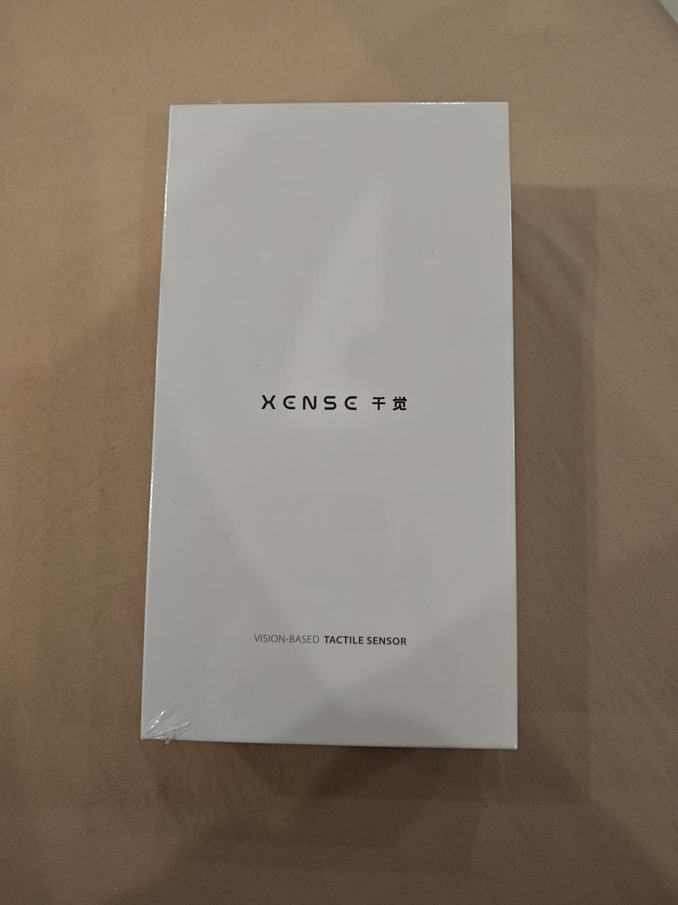</td>
    <td>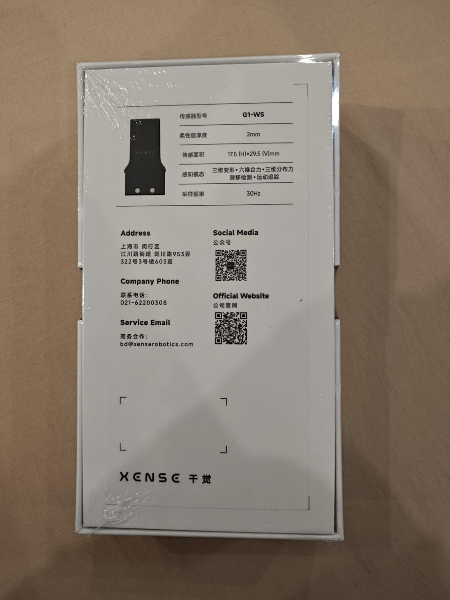</td>
  </tr>
  <tr>
    <td>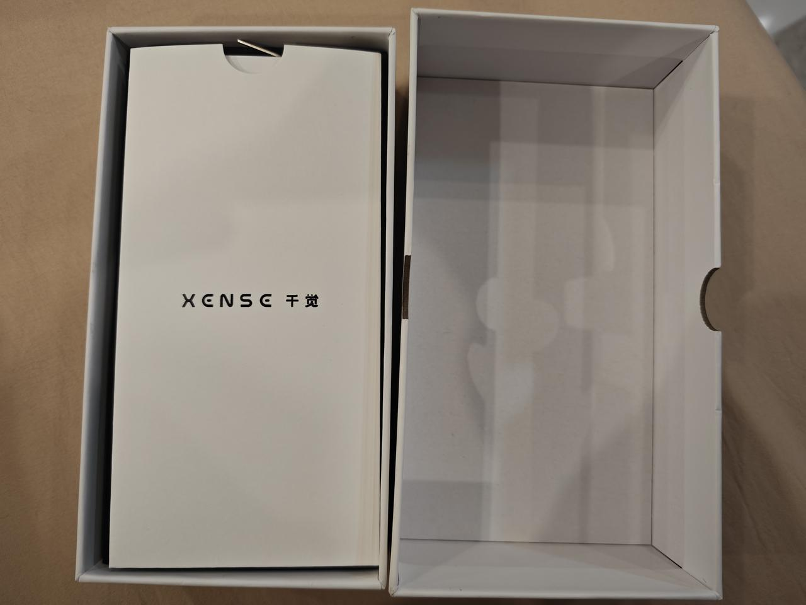</td>
    <td>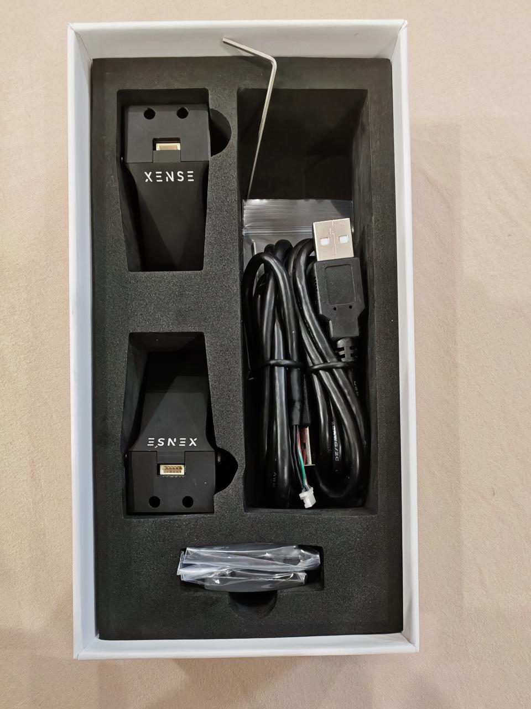</td>
  </tr>
  <tr>
    <td>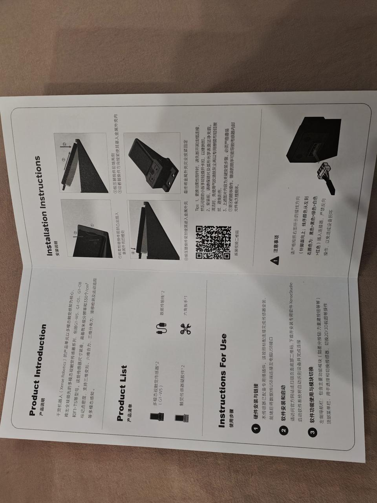</td>
    <td>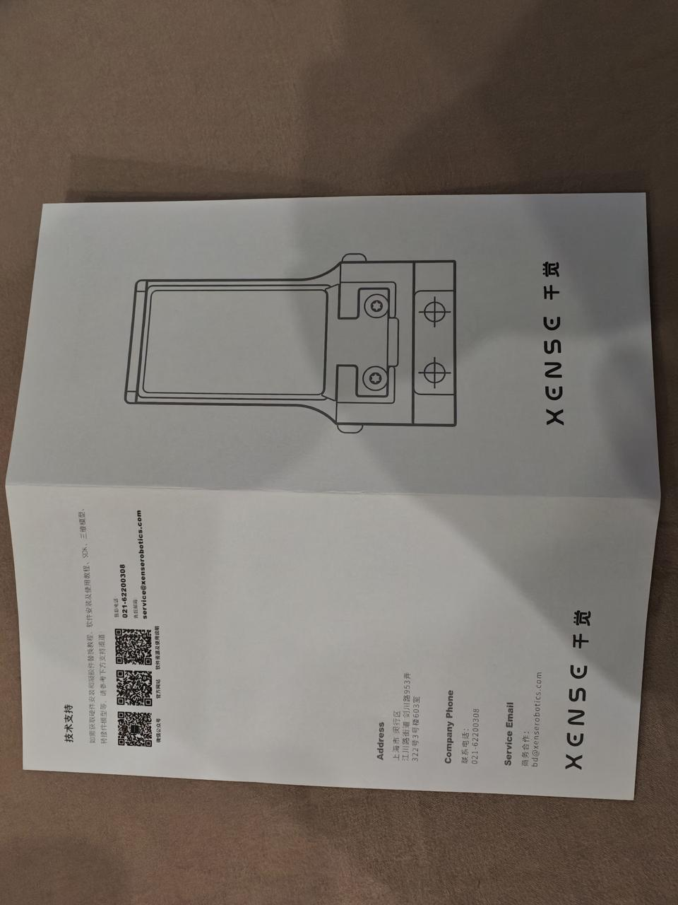</td>
  </tr>
</table>

<a id="urdf"></a>
## 3. urdf
you can see `STL` and `stp` file in `models` directory

<a id="conda"></a>
## 4. conda

进入 Xense SDK 目录

```bash
# 进入 Xense SDK 目录
cd xensesdk

# 创建并激活虚拟环境
conda create -n xenseenv python=3.9.19
conda activate xenseenv
```
---
<a id="gpu-driver"></a>
## 5. 根据对应显卡安装显卡驱动
---
<a id="cuda"></a>
## 6. CUDA & cuDNN

SDK 依赖 `onnxruntime-gpu` 及其配套的 `cudnn`、`cudatoolkit`。建议优先使用 CUDA 12.x 路线；如需兼容旧环境，可使用 CUDA 11.8。

<a id="cuda-12x"></a>
### 6.1 CUDA 12.x（推荐，示例为 12.9）

适用于当前 `xensesdk 1.7.0` 的 PyPI 安装流程。

<a id="cuda-12x-install"></a>
#### 6.1.1 安装 CUDA Toolkit 和 cuDNN
```
# 这个例子使用 CUDA 12.9
conda install nvidia/label/cuda-12.9.0::cuda-toolkit nvidia::cudnn
```
<details>
<summary>output</summary>

```
2 channel Terms of Service accepted
Channels:
 - defaults
 - nvidia
 - nvidia/label/cuda-12.9.0
Platform: linux-64
Collecting package metadata (repodata.json): done
Solving environment: done

## Package Plan ##

  environment location: /home/hkust/miniconda3/envs/xenseenv

  added / updated specs:
    - nvidia/label/cuda-12.9.0::cuda-toolkit
    - nvidia::cudnn


The following packages will be downloaded:

    package                    |            build
    ---------------------------|-----------------
    binutils_impl_linux-64-2.40|       h5293946_0         8.7 MB
    binutils_linux-64-2.40.0   |       h06a4308_3          25 KB
    cuda-cccl_linux-64-12.9.27 |       h06a4308_0         1.1 MB
    cuda-command-line-tools-12.9.0|                0          17 KB  nvidia
    cuda-compiler-12.9.0       |                0          17 KB  nvidia
    cuda-crt-dev_linux-64-12.9.41|                0          83 KB  nvidia
    cuda-crt-tools-12.9.41     |                0          19 KB  nvidia
    cuda-cudart-12.9.37        |                0          17 KB  nvidia
    cuda-cudart-dev-12.9.37    |                0          17 KB  nvidia
    cuda-cudart-dev_linux-64-12.9.37|                0         374 KB  nvidia
    cuda-cudart-static-12.9.37 |                0          17 KB  nvidia
    cuda-cudart-static_linux-64-12.9.37|                0         1.1 MB  nvidia
    cuda-cudart_linux-64-12.9.37|                0         187 KB  nvidia
    cuda-cuobjdump-12.9.26     |                1         234 KB  nvidia
    cuda-cupti-12.9.19         |                0         1.8 MB  nvidia
    cuda-cupti-dev-12.9.19     |                0         4.4 MB  nvidia
    cuda-cuxxfilt-12.9.19      |                1         208 KB  nvidia
    cuda-driver-dev-12.9.37    |                0          17 KB  nvidia
    cuda-driver-dev_linux-64-12.9.79|       hfb20e49_0          35 KB
    cuda-gdb-12.9.19           |                1         373 KB  nvidia
    cuda-libraries-12.9.0      |                0          17 KB  nvidia
    cuda-libraries-dev-12.9.0  |                0          17 KB  nvidia
    cuda-nsight-12.9.19        |                0       113.2 MB  nvidia
    cuda-nvcc-12.9.41          |                0          17 KB  nvidia
    cuda-nvcc-dev_linux-64-12.9.41|                0        13.8 MB  nvidia
    cuda-nvcc-impl-12.9.41     |                0          18 KB  nvidia
    cuda-nvcc-tools-12.9.41    |                0        26.3 MB  nvidia
    cuda-nvcc_linux-64-12.9.41 |                0          20 KB  nvidia
    cuda-nvdisasm-12.9.19      |                1         5.3 MB  nvidia
    cuda-nvml-dev-12.9.40      |                1         135 KB  nvidia
    cuda-nvprof-12.9.19        |                0         2.5 MB  nvidia
    cuda-nvprune-12.9.19       |                1          65 KB  nvidia
    cuda-nvrtc-12.9.41         |                0        64.2 MB  nvidia
    cuda-nvrtc-dev-12.9.41     |                0          30 KB  nvidia
    cuda-nvtx-12.9.19          |                0          24 KB  nvidia
    cuda-nvvm-dev_linux-64-12.9.41|                0          17 KB  nvidia
    cuda-nvvm-impl-12.9.41     |                0        20.4 MB  nvidia
    cuda-nvvm-tools-12.9.41    |                0        23.2 MB  nvidia
    cuda-nvvp-12.9.19          |                1       112.4 MB  nvidia
    cuda-opencl-12.9.19        |       h6334c1c_0          28 KB
    cuda-opencl-dev-12.9.19    |       h7354ed3_0          94 KB
    cuda-profiler-api-12.9.19  |                0          19 KB  nvidia
    cuda-sanitizer-api-12.9.27 |                1         8.7 MB  nvidia
    cuda-toolkit-12.9.0        |                0          17 KB  nvidia/label/cuda-12.9.0
    cuda-tools-12.9.0          |                0          17 KB  nvidia
    cuda-version-12.9          |       h9deaac8_3          22 KB
    cuda-visual-tools-12.9.0   |                0          17 KB  nvidia
    cudnn-9.14.0.64            |       h321a1a8_0          13 KB  nvidia
    fontconfig-2.15.0          |       h2c49b7f_0         262 KB
    freetype-2.14.1            |       hf5b9546_0         634 KB
    gcc_impl_linux-64-11.2.0   |       h1234567_1        22.2 MB
    gcc_linux-64-11.2.0        |       h931ca3c_3          26 KB
    gds-tools-1.14.0.30        |                4        37.8 MB  nvidia
    gmp-6.3.0                  |       h6a678d5_0         608 KB
    gxx_impl_linux-64-11.2.0   |       h1234567_1        10.6 MB
    gxx_linux-64-11.2.0        |       h06a4308_3          25 KB
    kernel-headers_linux-64-4.18.0|       h3108a97_1         1.2 MB
    ld_impl_linux-64-2.40      |       h12ee557_0         710 KB
    libcublas-12.9.0.13        |                0       446.0 MB  nvidia
    libcublas-dev-12.9.0.13    |                0          86 KB  nvidia
    libcudnn-9.14.0.64         |       hf94a4fa_0       428.2 MB  nvidia
    libcudnn-dev-9.14.0.64     |       h321a1a8_0          37 KB  nvidia
    libcufft-11.4.0.6          |                0       154.3 MB  nvidia
    libcufft-dev-11.4.0.6      |                0          28 KB  nvidia
    libcufile-1.14.0.30        |                4         946 KB  nvidia
    libcufile-dev-1.14.0.30    |                4          30 KB  nvidia
    libcurand-10.3.10.19       |       h7354ed3_0        44.1 MB
    libcurand-dev-10.3.10.19   |       h7354ed3_0         246 KB
    libcusolver-11.7.4.40      |                0       192.5 MB  nvidia
    libcusolver-dev-11.7.4.40  |                0          55 KB  nvidia
    libcusparse-12.5.9.5       |                0       199.3 MB  nvidia
    libcusparse-dev-12.5.9.5   |                0          47 KB  nvidia
    libgcc-devel_linux-64-11.2.0|       h1234567_1         2.5 MB
    libglib-2.86.3             |       h8b17d9a_0         3.9 MB
    libnpp-12.4.0.27           |                0       167.3 MB  nvidia
    libnpp-dev-12.4.0.27       |                0         445 KB  nvidia
    libnvfatbin-12.9.19        |                0         799 KB  nvidia
    libnvfatbin-dev-12.9.19    |                0          22 KB  nvidia
    libnvjitlink-12.9.41       |                0        29.2 MB  nvidia
    libnvjitlink-dev-12.9.41   |                0          21 KB  nvidia
    libnvjpeg-12.4.0.16        |                0         3.4 MB  nvidia
    libnvjpeg-dev-12.4.0.16    |                0          27 KB  nvidia
    libpng-1.6.55              |       h22898a0_0         241 KB
    libstdcxx-devel_linux-64-11.2.0|       h1234567_1        14.6 MB
    libxkbcommon-1.9.1         |       h69220b7_0         732 KB
    nsight-compute-2025.2.0.11 |                0       321.3 MB  nvidia
    nspr-4.37                  |       h8459abe_0         313 KB
    nss-3.117                  |       h3135ca0_0         1.9 MB
    ocl-icd-2.3.3              |       h47b2149_0         106 KB
    opencl-headers-2025.07.22  |       hfb20e49_0          52 KB
    sysroot_linux-64-2.28      |       h3108a97_1        23.0 MB
    xkeyboard-config-2.44      |       h382ed1a_1         887 KB
    ------------------------------------------------------------
                                           Total:        2.46 GB

The following NEW packages will be INSTALLED:

  binutils_impl_lin~ pkgs/main/linux-64::binutils_impl_linux-64-2.40-h5293946_0 
  binutils_linux-64  pkgs/main/linux-64::binutils_linux-64-2.40.0-h06a4308_3 
  bzip2              pkgs/main/linux-64::bzip2-1.0.8-h5eee18b_6 
  cuda-cccl_linux-64 pkgs/main/noarch::cuda-cccl_linux-64-12.9.27-h06a4308_0 
  cuda-command-line~ nvidia/linux-64::cuda-command-line-tools-12.9.0-0 
  cuda-compiler      nvidia/linux-64::cuda-compiler-12.9.0-0 
  cuda-crt-dev_linu~ nvidia/noarch::cuda-crt-dev_linux-64-12.9.41-0 
  cuda-crt-tools     nvidia/linux-64::cuda-crt-tools-12.9.41-0 
  cuda-cudart        nvidia/linux-64::cuda-cudart-12.9.37-0 
  cuda-cudart-dev    nvidia/linux-64::cuda-cudart-dev-12.9.37-0 
  cuda-cudart-dev_l~ nvidia/noarch::cuda-cudart-dev_linux-64-12.9.37-0 
  cuda-cudart-static nvidia/linux-64::cuda-cudart-static-12.9.37-0 
  cuda-cudart-stati~ nvidia/noarch::cuda-cudart-static_linux-64-12.9.37-0 
  cuda-cudart_linux~ nvidia/noarch::cuda-cudart_linux-64-12.9.37-0 
  cuda-cuobjdump     nvidia/linux-64::cuda-cuobjdump-12.9.26-1 
  cuda-cupti         nvidia/linux-64::cuda-cupti-12.9.19-0 
  cuda-cupti-dev     nvidia/linux-64::cuda-cupti-dev-12.9.19-0 
  cuda-cuxxfilt      nvidia/linux-64::cuda-cuxxfilt-12.9.19-1 
  cuda-driver-dev    nvidia/linux-64::cuda-driver-dev-12.9.37-0 
  cuda-driver-dev_l~ pkgs/main/noarch::cuda-driver-dev_linux-64-12.9.79-hfb20e49_0 
  cuda-gdb           nvidia/linux-64::cuda-gdb-12.9.19-1 
  cuda-libraries     nvidia/linux-64::cuda-libraries-12.9.0-0 
  cuda-libraries-dev nvidia/linux-64::cuda-libraries-dev-12.9.0-0 
  cuda-nsight        nvidia/linux-64::cuda-nsight-12.9.19-0 
  cuda-nvcc          nvidia/linux-64::cuda-nvcc-12.9.41-0 
  cuda-nvcc-dev_lin~ nvidia/noarch::cuda-nvcc-dev_linux-64-12.9.41-0 
  cuda-nvcc-impl     nvidia/linux-64::cuda-nvcc-impl-12.9.41-0 
  cuda-nvcc-tools    nvidia/linux-64::cuda-nvcc-tools-12.9.41-0 
  cuda-nvcc_linux-64 nvidia/linux-64::cuda-nvcc_linux-64-12.9.41-0 
  cuda-nvdisasm      nvidia/linux-64::cuda-nvdisasm-12.9.19-1 
  cuda-nvml-dev      nvidia/linux-64::cuda-nvml-dev-12.9.40-1 
  cuda-nvprof        nvidia/linux-64::cuda-nvprof-12.9.19-0 
  cuda-nvprune       nvidia/linux-64::cuda-nvprune-12.9.19-1 
  cuda-nvrtc         nvidia/linux-64::cuda-nvrtc-12.9.41-0 
  cuda-nvrtc-dev     nvidia/linux-64::cuda-nvrtc-dev-12.9.41-0 
  cuda-nvtx          nvidia/linux-64::cuda-nvtx-12.9.19-0 
  cuda-nvvm-dev_lin~ nvidia/noarch::cuda-nvvm-dev_linux-64-12.9.41-0 
  cuda-nvvm-impl     nvidia/linux-64::cuda-nvvm-impl-12.9.41-0 
  cuda-nvvm-tools    nvidia/linux-64::cuda-nvvm-tools-12.9.41-0 
  cuda-nvvp          nvidia/linux-64::cuda-nvvp-12.9.19-1 
  cuda-opencl        pkgs/main/linux-64::cuda-opencl-12.9.19-h6334c1c_0 
  cuda-opencl-dev    pkgs/main/linux-64::cuda-opencl-dev-12.9.19-h7354ed3_0 
  cuda-profiler-api  nvidia/linux-64::cuda-profiler-api-12.9.19-0 
  cuda-sanitizer-api nvidia/linux-64::cuda-sanitizer-api-12.9.27-1 
  cuda-toolkit       nvidia/label/cuda-12.9.0/linux-64::cuda-toolkit-12.9.0-0 
  cuda-tools         nvidia/linux-64::cuda-tools-12.9.0-0 
  cuda-version       pkgs/main/noarch::cuda-version-12.9-h9deaac8_3 
  cuda-visual-tools  nvidia/linux-64::cuda-visual-tools-12.9.0-0 
  cudnn              nvidia/linux-64::cudnn-9.14.0.64-h321a1a8_0 
  dbus               pkgs/main/linux-64::dbus-1.16.2-h5bd4931_0 
  expat              pkgs/main/linux-64::expat-2.7.4-h7354ed3_0 
  fontconfig         pkgs/main/linux-64::fontconfig-2.15.0-h2c49b7f_0 
  freetype           pkgs/main/linux-64::freetype-2.14.1-hf5b9546_0 
  gcc_impl_linux-64  pkgs/main/linux-64::gcc_impl_linux-64-11.2.0-h1234567_1 
  gcc_linux-64       pkgs/main/linux-64::gcc_linux-64-11.2.0-h931ca3c_3 
  gds-tools          nvidia/linux-64::gds-tools-1.14.0.30-4 
  gmp                pkgs/main/linux-64::gmp-6.3.0-h6a678d5_0 
  gxx_impl_linux-64  pkgs/main/linux-64::gxx_impl_linux-64-11.2.0-h1234567_1 
  gxx_linux-64       pkgs/main/linux-64::gxx_linux-64-11.2.0-h06a4308_3 
  icu                pkgs/main/linux-64::icu-73.1-h6a678d5_0 
  kernel-headers_li~ pkgs/main/noarch::kernel-headers_linux-64-4.18.0-h3108a97_1 
  libcublas          nvidia/linux-64::libcublas-12.9.0.13-0 
  libcublas-dev      nvidia/linux-64::libcublas-dev-12.9.0.13-0 
  libcudnn           nvidia/linux-64::libcudnn-9.14.0.64-hf94a4fa_0 
  libcudnn-dev       nvidia/linux-64::libcudnn-dev-9.14.0.64-h321a1a8_0 
  libcufft           nvidia/linux-64::libcufft-11.4.0.6-0 
  libcufft-dev       nvidia/linux-64::libcufft-dev-11.4.0.6-0 
  libcufile          nvidia/linux-64::libcufile-1.14.0.30-4 
  libcufile-dev      nvidia/linux-64::libcufile-dev-1.14.0.30-4 
  libcurand          pkgs/main/linux-64::libcurand-10.3.10.19-h7354ed3_0 
  libcurand-dev      pkgs/main/linux-64::libcurand-dev-10.3.10.19-h7354ed3_0 
  libcusolver        nvidia/linux-64::libcusolver-11.7.4.40-0 
  libcusolver-dev    nvidia/linux-64::libcusolver-dev-11.7.4.40-0 
  libcusparse        nvidia/linux-64::libcusparse-12.5.9.5-0 
  libcusparse-dev    nvidia/linux-64::libcusparse-dev-12.5.9.5-0 
  libexpat           pkgs/main/linux-64::libexpat-2.7.4-h7354ed3_0 
  libgcc-devel_linu~ pkgs/main/linux-64::libgcc-devel_linux-64-11.2.0-h1234567_1 
  libglib            pkgs/main/linux-64::libglib-2.86.3-h8b17d9a_0 
  libiconv           pkgs/main/linux-64::libiconv-1.18-h75a1612_0 
  libnpp             nvidia/linux-64::libnpp-12.4.0.27-0 
  libnpp-dev         nvidia/linux-64::libnpp-dev-12.4.0.27-0 
  libnvfatbin        nvidia/linux-64::libnvfatbin-12.9.19-0 
  libnvfatbin-dev    nvidia/linux-64::libnvfatbin-dev-12.9.19-0 
  libnvjitlink       nvidia/linux-64::libnvjitlink-12.9.41-0 
  libnvjitlink-dev   nvidia/linux-64::libnvjitlink-dev-12.9.41-0 
  libnvjpeg          nvidia/linux-64::libnvjpeg-12.4.0.16-0 
  libnvjpeg-dev      nvidia/linux-64::libnvjpeg-dev-12.4.0.16-0 
  libpng             pkgs/main/linux-64::libpng-1.6.55-h22898a0_0 
  libstdcxx-devel_l~ pkgs/main/linux-64::libstdcxx-devel_linux-64-11.2.0-h1234567_1 
  libuuid            pkgs/main/linux-64::libuuid-1.41.5-h5eee18b_0 
  libxkbcommon       pkgs/main/linux-64::libxkbcommon-1.9.1-h69220b7_0 
  libxml2            pkgs/main/linux-64::libxml2-2.13.9-h2c43086_0 
  nsight-compute     nvidia/linux-64::nsight-compute-2025.2.0.11-0 
  nspr               pkgs/main/linux-64::nspr-4.37-h8459abe_0 
  nss                pkgs/main/linux-64::nss-3.117-h3135ca0_0 
  ocl-icd            pkgs/main/linux-64::ocl-icd-2.3.3-h47b2149_0 
  opencl-headers     pkgs/main/linux-64::opencl-headers-2025.07.22-hfb20e49_0 
  pcre2              pkgs/main/linux-64::pcre2-10.46-hf426167_0 
  sysroot_linux-64   pkgs/main/noarch::sysroot_linux-64-2.28-h3108a97_1 
  xkeyboard-config   pkgs/main/linux-64::xkeyboard-config-2.44-h382ed1a_1 

The following packages will be DOWNGRADED:

  ld_impl_linux-64                          2.44-h9e0c5a2_3 --> 2.40-h12ee557_0 


Proceed ([y]/n)? 


Downloading and Extracting Packages:
                                                                                
Preparing transaction: done                                                     
Verifying transaction: done                                                     
Executing transaction: done
```
</details>

<a id="cuda-12x-env"></a>
#### 6.1.2 配置 `LD_LIBRARY_PATH`
```bash
export LD_LIBRARY_PATH=$CONDA_PREFIX/lib:$CONDA_PREFIX/lib64 #（临时）
mkdir -p $CONDA_PREFIX/etc/conda/activate.d && echo 'export LD_LIBRARY_PATH=$CONDA_PREFIX/lib:$CONDA_PREFIX/lib64:$LD_LIBRARY_PATH' > $CONDA_PREFIX/etc/conda/activate.d/env_vars.sh #（永久）
```
验证：
```bash
nvcc -V
```
输出示例：
```
nvcc: NVIDIA (R) Cuda compiler driver
Copyright (c) 2005-2025 NVIDIA Corporation
Built on Wed_Apr__9_19:24:57_PDT_2025
Cuda compilation tools, release 12.9, V12.9.41
Build cuda_12.9.r12.9/compiler.35813241_0
```

<a id="cuda-118"></a>
### 6.2 CUDA 11.8（兼容旧环境）

适用于仍需使用 `CUDA Toolkit 11.8` 和 `cuDNN 8.9.2.26` 的场景。

<a id="cuda-118-conda"></a>
#### 6.2.1 通过 Conda 直接安装

可先查询可用版本：
```
conda search cudnn
conda search cudatoolkit
```
然后安装所需版本：
```
conda install cudnn==8.9.2.26 cudatoolkit==11.8.0
```
<details>
<summary>output</summary>

```
Channels:
 - defaults
Platform: linux-64
Collecting package metadata (repodata.json): done
Solving environment: done


==> WARNING: A newer version of conda exists. <==
    current version: 25.3.1
    latest version: 25.5.0

Please update conda by running

    $ conda update -n base -c defaults conda


## Package Plan ##

  environment location: /home/tars/system/miniconda3/envs/xenseenv

  added / updated specs:
    - cudatoolkit==11.8.0
    - cudnn==8.9.2.26


The following packages will be downloaded:

    package                    |            build
    ---------------------------|-----------------
    cudatoolkit-11.8.0         |       h6a678d5_0       630.7 MB
    cudnn-8.9.2.26             |         cuda11_0       469.4 MB
    ------------------------------------------------------------
                                           Total:        1.07 GB

The following NEW packages will be INSTALLED:

  cudatoolkit        pkgs/main/linux-64::cudatoolkit-11.8.0-h6a678d5_0 
  cudnn              pkgs/main/linux-64::cudnn-8.9.2.26-cuda11_0 


Proceed ([y]/n)? y


Downloading and Extracting Packages:
                                                                                                     
Preparing transaction: done                                                                          
Verifying transaction: done
Executing transaction: \ By downloading and using the CUDA Toolkit conda packages, you accept the terms and conditions of the CUDA End User License Agreement (EULA): https://docs.nvidia.com/cuda/eula/index.html

done
```
</details>

<a id="cuda-118-local"></a>
#### 6.2.2 从本地 Conda 环境包安装
```bash
conda install --use-local cudatoolkit-11.8.0-hd77b12b_0.conda
conda install --use-local cudnn-8.9.2.26-cuda11_0.conda
```

<a id="install-sdk"></a>
## 7. install Xense SDK Package (1.7.0)
```bash
# 从 PyPI 安装
pip install xensesdk -i https://repo.huaweicloud.com/repository/pypi/simple/
```
<details>
<summary>output（安装过程会下载较多依赖，耗时较长）</summary>

```
pip install xensesdk -i https://repo.huaweicloud.com/repository/pypi/simple/
Looking in indexes: https://repo.huaweicloud.com/repository/pypi/simple/
Collecting xensesdk
  Downloading https://repo.huaweicloud.com/repository/pypi/packages/49/7d/54fc29f35110e1ce46e7758b134954c8ae2e0b254c65263063352e3145d8/xensesdk-1.7.0-cp39-cp39-manylinux_2_31_x86_64.whl (41.4 MB)
     ━━━━━━━━━━━━━━━━━━━━━━━━━━━━━━━━━━━━━━━━ 41.4/41.4 MB 3.4 MB/s  0:00:12
Collecting cypack (from xensesdk)
  Downloading https://repo.huaweicloud.com/repository/pypi/packages/10/3f/65674885ca3485cb82911e1510bda7cfe328be7e17fd4e42ed1d42b7f702/cypack-0.1.0.tar.gz (12 kB)
  Installing build dependencies ... done
  Getting requirements to build wheel ... done
  Preparing metadata (pyproject.toml) ... done
Collecting numpy<=1.26.4 (from xensesdk)
  Downloading https://repo.huaweicloud.com/repository/pypi/packages/54/30/c2a907b9443cf42b90c17ad10c1e8fa801975f01cb9764f3f8eb8aea638b/numpy-1.26.4-cp39-cp39-manylinux_2_17_x86_64.manylinux2014_x86_64.whl (18.2 MB)
     ━━━━━━━━━━━━━━━━━━━━━━━━━━━━━━━━━━━━━━━━ 18.2/18.2 MB 3.9 MB/s  0:00:04
Collecting opencv-python==4.10.0.84 (from xensesdk)
  Downloading https://repo.huaweicloud.com/repository/pypi/packages/3f/a4/d2537f47fd7fcfba966bd806e3ec18e7ee1681056d4b0a9c8d983983e4d5/opencv_python-4.10.0.84-cp37-abi3-manylinux_2_17_x86_64.manylinux2014_x86_64.whl (62.5 MB)
     ━━━━━━━━━━━━━━━━━━━━━━━━━━━━━━━━━━━━━━━━ 62.5/62.5 MB 1.2 MB/s  0:00:54
Collecting PyOpenGL==3.1.7 (from xensesdk)
  Downloading https://repo.huaweicloud.com/repository/pypi/packages/99/48/00e31747821d3fc56faddd00a4725454d1e694a8b67d715cf20f531506a5/PyOpenGL-3.1.7-py3-none-any.whl (2.4 MB)
     ━━━━━━━━━━━━━━━━━━━━━━━━━━━━━━━━━━━━━━━━ 2.4/2.4 MB 10.3 MB/s  0:00:00
Collecting assimp-py<=1.0.8 (from xensesdk)
  Downloading https://repo.huaweicloud.com/repository/pypi/packages/a2/ac/5d846290a4bfb057208eff8a381414730f4b42d2ce5aad9691fe071f33e5/assimp_py-1.0.8-cp39-cp39-manylinux_2_27_x86_64.manylinux_2_28_x86_64.whl (3.8 MB)
     ━━━━━━━━━━━━━━━━━━━━━━━━━━━━━━━━━━━━━━━━ 3.8/3.8 MB 3.8 MB/s  0:00:00
Collecting pillow>=10.2.0 (from xensesdk)
  Downloading https://repo.huaweicloud.com/repository/pypi/packages/a5/a0/98a3630f0b57f77bae67716562513d3032ae70414fcaf02750279c389a9e/pillow-11.3.0-cp39-cp39-manylinux_2_27_x86_64.manylinux_2_28_x86_64.whl (6.6 MB)
     ━━━━━━━━━━━━━━━━━━━━━━━━━━━━━━━━━━━━━━━━ 6.6/6.6 MB 6.2 MB/s  0:00:01
Collecting PySide6 (from xensesdk)
  Downloading https://repo.huaweicloud.com/repository/pypi/packages/35/d3/ab5cd2fac3d34469c7376e0cd18eec92905dbe44748c70bda7699a2a7206/pyside6-6.10.2-cp39-abi3-manylinux_2_34_x86_64.whl (563 kB)
     ━━━━━━━━━━━━━━━━━━━━━━━━━━━━━━━━━━━━━━━━ 563.4/563.4 kB 562.9 kB/s  0:00:00
Collecting cryptography==43.0.3 (from xensesdk)
  Downloading https://repo.huaweicloud.com/repository/pypi/packages/ac/25/e715fa0bc24ac2114ed69da33adf451a38abb6f3f24ec207908112e9ba53/cryptography-43.0.3-cp39-abi3-manylinux_2_28_x86_64.whl (4.0 MB)
     ━━━━━━━━━━━━━━━━━━━━━━━━━━━━━━━━━━━━━━━━ 4.0/4.0 MB 877.3 kB/s  0:00:04
Collecting PyYAML==6.0.2 (from xensesdk)
  Downloading https://repo.huaweicloud.com/repository/pypi/packages/3d/32/e7bd8535d22ea2874cef6a81021ba019474ace0d13a4819c2a4bce79bd6a/PyYAML-6.0.2-cp39-cp39-manylinux_2_17_x86_64.manylinux2014_x86_64.whl (737 kB)
     ━━━━━━━━━━━━━━━━━━━━━━━━━━━━━━━━━━━━━━━━ 737.4/737.4 kB 8.7 MB/s  0:00:00
Collecting qtpy (from xensesdk)
  Downloading https://repo.huaweicloud.com/repository/pypi/packages/69/76/37c0ccd5ab968a6a438f9c623aeecc84c202ab2fabc6a8fd927580c15b5a/QtPy-2.4.3-py3-none-any.whl (95 kB)
Collecting h5py (from xensesdk)
  Downloading https://repo.huaweicloud.com/repository/pypi/packages/f7/07/e088f89f04fdbe57ddf9de377f857158d3daa38cf5d0fb20ef9bd489e313/h5py-3.14.0-cp39-cp39-manylinux_2_17_x86_64.manylinux2014_x86_64.whl (4.6 MB)
     ━━━━━━━━━━━━━━━━━━━━━━━━━━━━━━━━━━━━━━━━ 4.6/4.6 MB 12.7 MB/s  0:00:00
Collecting av>=13.1.0 (from xensesdk)
  Downloading https://repo.huaweicloud.com/repository/pypi/packages/05/da/bcc82726fca6554420b23c1c04449eb6545737e78bb908a8cdf1cdb1eb68/av-15.1.0-cp39-cp39-manylinux_2_28_x86_64.whl (39.1 MB)
     ━━━━━━━━━━━━━━━━━━━━━━━━━━━━━━━━━━━━━━━━ 39.1/39.1 MB 3.5 MB/s  0:00:11
Collecting scipy==1.13.1 (from xensesdk)
  Downloading https://repo.huaweicloud.com/repository/pypi/packages/35/f5/d0ad1a96f80962ba65e2ce1de6a1e59edecd1f0a7b55990ed208848012e0/scipy-1.13.1-cp39-cp39-manylinux_2_17_x86_64.manylinux2014_x86_64.whl (38.6 MB)
     ━━━━━━━━━━━━━━━━━━━━━━━━━━━━━━━━━━━━━━━━ 38.6/38.6 MB 3.5 MB/s  0:00:11
Collecting lz4 (from xensesdk)
  Downloading https://repo.huaweicloud.com/repository/pypi/packages/73/57/551a7f95825c9721d8bee4ec02d8b139b1a44796e63d09a737ca0d67b6b1/lz4-4.4.5-cp39-cp39-manylinux2014_x86_64.manylinux_2_17_x86_64.manylinux_2_28_x86_64.whl (1.4 MB)
     ━━━━━━━━━━━━━━━━━━━━━━━━━━━━━━━━━━━━━━━━ 1.4/1.4 MB 5.0 MB/s  0:00:00
Collecting psutil>=5.9.0 (from xensesdk)
  Downloading https://repo.huaweicloud.com/repository/pypi/packages/b5/70/5d8df3b09e25bce090399cf48e452d25c935ab72dad19406c77f4e828045/psutil-7.2.2-cp36-abi3-manylinux2010_x86_64.manylinux_2_12_x86_64.manylinux_2_28_x86_64.whl (155 kB)
Collecting pyudev (from xensesdk)
  Downloading https://repo.huaweicloud.com/repository/pypi/packages/2a/51/3dc0cd6498b24dea3cdeaed648568e3ca7454d41334d840b114156d7479f/pyudev-0.24.4-py3-none-any.whl (62 kB)
Collecting cyclonedds-nightly==2025.7.29 (from xensesdk)
  Downloading https://repo.huaweicloud.com/repository/pypi/packages/dc/74/bb59c7c085b0a2d9c95351a094300a59e6490263e0cc2237e9dae55e06ca/cyclonedds_nightly-2025.7.29-cp39-cp39-manylinux_2_17_x86_64.manylinux2014_x86_64.whl (7.6 MB)
     ━━━━━━━━━━━━━━━━━━━━━━━━━━━━━━━━━━━━━━━━ 7.6/7.6 MB 5.8 MB/s  0:00:01
Collecting onnxruntime-gpu<=1.20 (from xensesdk)
  Downloading https://repo.huaweicloud.com/repository/pypi/packages/ba/75/7d6dafa54255a978b0698cfe3d073208e6b0df311b15468b3cf9e33e6053/onnxruntime_gpu-1.19.2-cp39-cp39-manylinux_2_27_x86_64.manylinux_2_28_x86_64.whl (226.2 MB)
     ━━━━━━━━━━━━━━━━━━━━━━━━━━━━━━━━━━━━━━━━ 226.2/226.2 MB 1.5 MB/s  0:01:24
Collecting cffi>=1.12 (from cryptography==43.0.3->xensesdk)
  Downloading https://repo.huaweicloud.com/repository/pypi/packages/1f/74/cc4096ce66f5939042ae094e2e96f53426a979864aa1f96a621ad128be27/cffi-2.0.0-cp39-cp39-manylinux2014_x86_64.manylinux_2_17_x86_64.whl (216 kB)
Collecting rich-click (from cyclonedds-nightly==2025.7.29->xensesdk)
  Downloading https://repo.huaweicloud.com/repository/pypi/packages/ca/e5/d708d262b600a352abe01c2ae360d8ff75b0af819b78e9af293191d928e6/rich_click-1.9.7-py3-none-any.whl (71 kB)
Collecting coloredlogs (from onnxruntime-gpu<=1.20->xensesdk)
  Downloading https://repo.huaweicloud.com/repository/pypi/packages/a7/06/3d6badcf13db419e25b07041d9c7b4a2c331d3f4e7134445ec5df57714cd/coloredlogs-15.0.1-py2.py3-none-any.whl (46 kB)
Collecting flatbuffers (from onnxruntime-gpu<=1.20->xensesdk)
  Downloading https://repo.huaweicloud.com/repository/pypi/packages/e8/2d/d2a548598be01649e2d46231d151a6c56d10b964d94043a335ae56ea2d92/flatbuffers-25.12.19-py2.py3-none-any.whl (26 kB)
Collecting packaging (from onnxruntime-gpu<=1.20->xensesdk)
  Using cached https://repo.huaweicloud.com/repository/pypi/packages/b7/b9/c538f279a4e237a006a2c98387d081e9eb060d203d8ed34467cc0f0b9b53/packaging-26.0-py3-none-any.whl (74 kB)
Collecting protobuf (from onnxruntime-gpu<=1.20->xensesdk)
  Downloading https://repo.huaweicloud.com/repository/pypi/packages/16/92/d1e32e3e0d894fe00b15ce28ad4944ab692713f2e7f0a99787405e43533a/protobuf-6.33.6-cp39-abi3-manylinux2014_x86_64.whl (323 kB)
Collecting sympy (from onnxruntime-gpu<=1.20->xensesdk)
  Downloading https://repo.huaweicloud.com/repository/pypi/packages/a2/09/77d55d46fd61b4a135c444fc97158ef34a095e5681d0a6c10b75bf356191/sympy-1.14.0-py3-none-any.whl (6.3 MB)
     ━━━━━━━━━━━━━━━━━━━━━━━━━━━━━━━━━━━━━━━━ 6.3/6.3 MB 3.3 MB/s  0:00:01
Collecting pycparser (from cffi>=1.12->cryptography==43.0.3->xensesdk)
  Downloading https://repo.huaweicloud.com/repository/pypi/packages/a0/e3/59cd50310fc9b59512193629e1984c1f95e5c8ae6e5d8c69532ccc65a7fe/pycparser-2.23-py3-none-any.whl (118 kB)
Collecting humanfriendly>=9.1 (from coloredlogs->onnxruntime-gpu<=1.20->xensesdk)
  Downloading https://repo.huaweicloud.com/repository/pypi/packages/f0/0f/310fb31e39e2d734ccaa2c0fb981ee41f7bd5056ce9bc29b2248bd569169/humanfriendly-10.0-py2.py3-none-any.whl (86 kB)
Collecting cython<3.1.0,>=0.29.24 (from cypack->xensesdk)
  Using cached https://repo.huaweicloud.com/repository/pypi/packages/cb/2e/7e6a45bc7a1ff327fca37c3473eb36864ec78abf81ecfb7eed0dab4a9a90/Cython-3.0.12-cp39-cp39-manylinux_2_17_x86_64.manylinux2014_x86_64.whl (3.6 MB)
Requirement already satisfied: setuptools>=42 in ./miniconda3/envs/xenseenv/lib/python3.9/site-packages (from cypack->xensesdk) (80.9.0)
Collecting shiboken6==6.10.2 (from PySide6->xensesdk)
  Downloading https://repo.huaweicloud.com/repository/pypi/packages/52/88/292e0576489c46624ab419ee284ac5a59ae10e2eb34a58b6abca51dfd290/shiboken6-6.10.2-cp39-abi3-manylinux_2_34_x86_64.whl (273 kB)
Collecting PySide6_Essentials==6.10.2 (from PySide6->xensesdk)
  Downloading https://repo.huaweicloud.com/repository/pypi/packages/99/20/3a6ca95052e1744b5a3eba164e2dd451d358a3dcaf78179de4b45c8e3f47/pyside6_essentials-6.10.2-cp39-abi3-manylinux_2_34_x86_64.whl (77.0 MB)
     ━━━━━━━━━━━━━━━━━━━━━━━━━━━━━━━━━━━━━━━━ 77.0/77.0 MB 1.2 MB/s  0:01:03
Collecting PySide6_Addons==6.10.2 (from PySide6->xensesdk)
  Downloading https://repo.huaweicloud.com/repository/pypi/packages/a5/69/e1ab8c756fd3984b1fd7b186446227f524f6b561160bfbfdba8874b4709a/pyside6_addons-6.10.2-cp39-abi3-manylinux_2_34_x86_64.whl (170.7 MB)
     ━━━━━━━━━━━━━━━━━━━━━━━━━━━━━━━━━━━━━━━━ 170.7/170.7 MB 1.1 MB/s  0:02:36
Collecting click>=8 (from rich-click->cyclonedds-nightly==2025.7.29->xensesdk)
  Downloading https://repo.huaweicloud.com/repository/pypi/packages/7e/d4/7ebdbd03970677812aac39c869717059dbb71a4cfc033ca6e5221787892c/click-8.1.8-py3-none-any.whl (98 kB)
Collecting rich>=12 (from rich-click->cyclonedds-nightly==2025.7.29->xensesdk)
  Downloading https://repo.huaweicloud.com/repository/pypi/packages/14/25/b208c5683343959b670dc001595f2f3737e051da617f66c31f7c4fa93abc/rich-14.3.3-py3-none-any.whl (310 kB)
Collecting typing-extensions>=4 (from rich-click->cyclonedds-nightly==2025.7.29->xensesdk)
  Downloading https://repo.huaweicloud.com/repository/pypi/packages/18/67/36e9267722cc04a6b9f15c7f3441c2363321a3ea07da7ae0c0707beb2a9c/typing_extensions-4.15.0-py3-none-any.whl (44 kB)
Collecting markdown-it-py>=2.2.0 (from rich>=12->rich-click->cyclonedds-nightly==2025.7.29->xensesdk)
  Downloading https://repo.huaweicloud.com/repository/pypi/packages/42/d7/1ec15b46af6af88f19b8e5ffea08fa375d433c998b8a7639e76935c14f1f/markdown_it_py-3.0.0-py3-none-any.whl (87 kB)
Collecting pygments<3.0.0,>=2.13.0 (from rich>=12->rich-click->cyclonedds-nightly==2025.7.29->xensesdk)
  Downloading https://repo.huaweicloud.com/repository/pypi/packages/c7/21/705964c7812476f378728bdf590ca4b771ec72385c533964653c68e86bdc/pygments-2.19.2-py3-none-any.whl (1.2 MB)
     ━━━━━━━━━━━━━━━━━━━━━━━━━━━━━━━━━━━━━━━━ 1.2/1.2 MB 1.9 MB/s  0:00:00
Collecting mdurl~=0.1 (from markdown-it-py>=2.2.0->rich>=12->rich-click->cyclonedds-nightly==2025.7.29->xensesdk)
  Downloading https://repo.huaweicloud.com/repository/pypi/packages/b3/38/89ba8ad64ae25be8de66a6d463314cf1eb366222074cfda9ee839c56a4b4/mdurl-0.1.2-py3-none-any.whl (10.0 kB)
Collecting mpmath<1.4,>=1.1.0 (from sympy->onnxruntime-gpu<=1.20->xensesdk)
  Downloading https://repo.huaweicloud.com/repository/pypi/packages/43/e3/7d92a15f894aa0c9c4b49b8ee9ac9850d6e63b03c9c32c0367a13ae62209/mpmath-1.3.0-py3-none-any.whl (536 kB)
     ━━━━━━━━━━━━━━━━━━━━━━━━━━━━━━━━━━━━━━━━ 536.2/536.2 kB 2.5 MB/s  0:00:00
Building wheels for collected packages: cypack
  Building wheel for cypack (pyproject.toml) ... done
  Created wheel for cypack: filename=cypack-0.1.0-py3-none-any.whl size=13355 sha256=f569aa20e68151a8cf12d064c9ea01bef51b4a14ad09429f74f5bba2782d731d
  Stored in directory: /home/hkust/.cache/pip/wheels/46/d3/04/06e9a915d003fdad3bbb5405e8b35e06c728208fab20ead124
Successfully built cypack
Installing collected packages: PyOpenGL, mpmath, flatbuffers, assimp-py, typing-extensions, sympy, shiboken6, PyYAML, pyudev, pygments, pycparser, psutil, protobuf, pillow, packaging, numpy, mdurl, lz4, humanfriendly, cython, click, av, scipy, qtpy, PySide6_Essentials, opencv-python, markdown-it-py, h5py, cypack, coloredlogs, cffi, rich, PySide6_Addons, onnxruntime-gpu, cryptography, rich-click, PySide6, cyclonedds-nightly, xensesdk
Successfully installed PyOpenGL-3.1.7 PySide6-6.10.2 PySide6_Addons-6.10.2 PySide6_Essentials-6.10.2 PyYAML-6.0.2 assimp-py-1.0.8 av-15.1.0 cffi-2.0.0 click-8.1.8 coloredlogs-15.0.1 cryptography-43.0.3 cyclonedds-nightly-2025.7.29 cypack-0.1.0 cython-3.0.12 flatbuffers-25.12.19 h5py-3.14.0 humanfriendly-10.0 lz4-4.4.5 markdown-it-py-3.0.0 mdurl-0.1.2 mpmath-1.3.0 numpy-1.26.4 onnxruntime-gpu-1.19.2 opencv-python-4.10.0.84 packaging-26.0 pillow-11.3.0 protobuf-6.33.6 psutil-7.2.2 pycparser-2.23 pygments-2.19.2 pyudev-0.24.4 qtpy-2.4.3 rich-14.3.3 rich-click-1.9.7 scipy-1.13.1 shiboken6-6.10.2 sympy-1.14.0 typing-extensions-4.15.0 xensesdk-1.7.0
```
</details>

---

<a id="force"></a>
## 8. force 

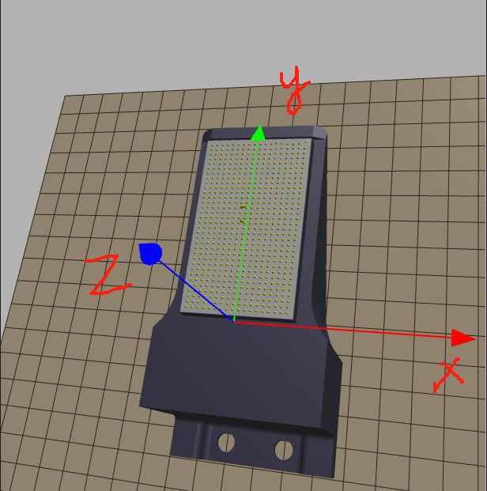

<a id="config"></a>
## 9. config

使用前请先获得对应传感器配置文件，文件和传感器型号一一对应。

根据具体传感器参数来修改`config/config.yaml`文件

```yaml
xense:
  sensor1_id: 'OG000204' # left / 单传感器脚本默认读取该 ID
  sensor2_id: 'OG000165' # right / 双传感器脚本读取该 ID
  freq: 60

examples:
  data_processing_video_path: ''
  finger_config_path: ''
  record_data_dir: 'Examples/output'
  record_data_duration_seconds: 5
  remote_ip: '192.168.1.120'

```

说明：

- `API/single` 下的 `01_create_method.py`、`02_selectSensorInfo_Method.py`、`03_createSolver.py`、`04_show.py` 默认读取 `xense.sensor1_id`。
- `API/double/05_show.py` 默认读取 `xense.sensor1_id` 作为左侧传感器，读取 `xense.sensor2_id` 作为右侧传感器。
- `Examples` 目录下示例脚本也默认读取 `config/config.yaml`，并支持通过 `--config` 指定其他 YAML 配置文件。
- `xense.freq` 用于控制 `03_createSolver.py` 的保存频率，以及 `04_show.py` 的实时显示频率。
- 所有上述脚本均支持 `--config` 参数，默认配置路径为仓库根目录下的 `config/config.yaml`。
- `config/config_loader.py` 已移除，脚本现在直接读取 YAML 配置文件。

<a id="api-docs"></a>
## 10. API 文档
本目录已按单传感器和双传感器拆分：

- `API/single`：单传感器相关示例
- `API/double`：双传感器相关示例（当前为双传感器图像拼接显示脚本）

默认情况下，这些脚本都会读取 `config/config.yaml`。如果你需要使用其他配置文件，可以在命令后追加 `--config /path/to/config.yaml`。

<a id="api-docs-single-create"></a>
### 10.1 single create_method
```bash
python ~/xensesdk/API/single/01_create_method.py
# or
python ~/xensesdk/API/single/01_create_method.py --config config/config.yaml
```

说明：

- 脚本会读取 `xense.sensor1_id` 并创建一个 `Sensor` 实例。
- 示例运行完成后会自动调用 `release()` 释放资源。

<details>
<summary>output</summary>

```text
Found Xense devices: {'OG000165': 2}
Read config from OG000165: cam_id_2 success!
In SDK: [Network] Camera 2 connected
Init infer engine
infer session using GPU
In SDK: [Network] Camera 2 disconnected
```

</details>

<a id="api-docs-single-select"></a>
### 10.2 single selectSensorInfo_method
```bash
python ~/xensesdk/API/single/02_selectSensorInfo_Method.py
# or
python ~/xensesdk/API/single/02_selectSensorInfo_Method.py --config config/config.yaml
```

说明：

- 脚本会读取 `xense.sensor1_id`，并一次性输出多种传感器数据的 shape。

<details>
<summary>output</summary>

```text
Found Xense devices: {'OG000165': 2}
Read config from OG000165: cam_id_2 success!
In SDK: [Network] Camera 2 connected
Init infer engine
infer session using GPU
Rectified image shape: (700, 400, 3)
Difference image shape: (700, 400, 3)
Depth image shape: (700, 400)
3D force distribution shape: (35, 20, 3)
Normal force component: (35, 20, 3)
6-dimensional resultant force: (6,)
Tangential displacement shape: (26, 14, 2)
Current frame 3D mesh shape: (35, 20, 3)
Initial 3D mesh shape: (35, 20, 3)
Mesh deformation vector: (35, 20, 3)
Sensor timestamp: 1773420554.5228953
In SDK: [Network] Camera 2 disconnected
```

</details>

<a id="api-docs-single-solver"></a>
### 10.3 single createSolver
```bash
python ~/xensesdk/API/single/03_createSolver.py
# or
python ~/xensesdk/API/single/03_createSolver.py --config config/config.yaml
```

说明：

- 图像和运行时配置会保存到 `API/single/test_dir`，脚本会自动创建该目录。
- 保存使用的传感器 ID 读取自 `xense.sensor1_id`。
- 保存频率读取 `config/config.yaml` 中的 `xense.freq`。

<details>
<summary>output</summary>

```text
Found Xense devices: {'OG000165': 2}
Read config from OG000165: cam_id_2 success!
In SDK: [Network] Camera 2 connected
Init infer engine
infer session using GPU
Saved /home/leishen/xensesdk/API/single/test_dir/OG000165_000.png
...
模型已并保存到: /home/leishen/xensesdk/API/single/test_dir/runtime_OG000165
In SDK: [Network] Camera 2 disconnected
Init infer engine
infer session using GPU
Data saved and replayed successfully.
```

</details>

<a id="api-docs-single-show"></a>
### 10.4 single real-time show image
```bash
python ~/xensesdk/API/single/04_show.py
# or
python ~/xensesdk/API/single/04_show.py --config config/config.yaml
```

说明：

- 实时显示使用的传感器 ID 读取自 `xense.sensor1_id`。
- 运行频率读取 `config/config.yaml` 中的 `xense.freq`。
- 启动后会先将运行时配置导出到 `API/single/test_dir/runtime_<sensor_id>`，再创建 solver 实时计算深度图。

<details>
<summary>output</summary>

```text
Found Xense devices: {'OG000165': 1}
Read config from OG000165: cam_id_1 success!
In SDK: [Network] Camera 1 connected
Init infer engine
infer session using GPU
模型已并保存到: /home/leishen/cxy/xensesdk/API/single/test_dir/runtime_OG000165
Init infer engine
infer session using GPU
在终端按 Ctrl+C 退出实时显示
```

</details>

| Rectify | Depth |
| --- | --- |
| 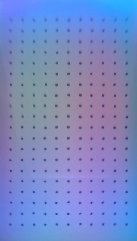 |  |

<a id="api-docs-double"></a>
### 10.5 double sensors

<table>
  <tr>
    <td align="center" width="64"><strong>⚠️</strong></td>
    <td>
      <strong>重要提示</strong><br>
      连接 2 个传感器时，请不要将 2 个 USB 同时连接在同一个 Hub 上。
    </td>
  </tr>
</table>

```bash
python ~/xensesdk/API/double/05_show.py
# or
python ~/xensesdk/API/double/05_show.py --config config/config.yaml
```

<details>
<summary>output</summary>

```text
Found Xense devices: {'OG000708': 16, 'OG000869': 14}
Read config from OG000869: cam_id_14 success!
In SDK: [Network] Camera 14 connected
Init infer engine
infer session using GPU
Found Xense devices: {'OG000708': 16, 'OG000869': 14}
Read config from OG000708: cam_id_16 success!
In SDK: [Network] Camera 16 connected
Init infer engine
infer session using GPU
```

</details>
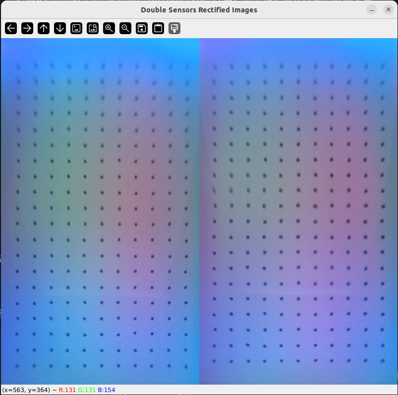

说明：

- 左侧传感器读取 `xense.sensor1_id`，右侧传感器读取 `xense.sensor2_id`。
- 脚本会读取两个传感器的 `Rectify` 图像并进行横向拼接显示。
- 默认窗口标题为 `Double Sensors Rectified Images`。
- 在图像窗口按 `q` 退出程序，脚本会自动释放两个传感器连接。

---
<a id="examples"></a>
## 11. Example
<a id="example-force"></a>
### 11.1 example_force.py
```
python ~/xensesdk/Examples/example_force.py
```
<details>
<summary>output</summary>

```
Found Xense devices: {'OG000165': 0}
new flash read fail, fallback.
new flash read fail, fallback.
new flash read fail, fallback.
new flash read fail, fallback.
Read config from OG000165: cam_id_0 success!
In SDK: [Network] Camera 0 connected
Init infer engine
infer session using GPU
```

</details>
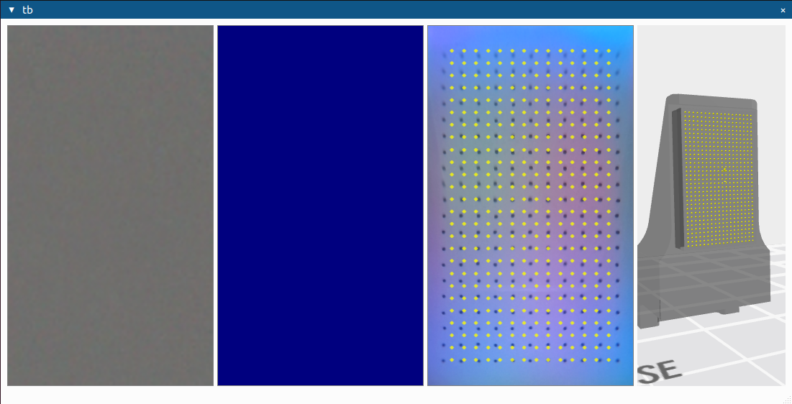

<a id="example-marker-detect"></a>
### 11.2 example_marker_detect.py
```
python ~/xensesdk/Examples/example_marker_detect.py
```
<details>
<summary>output</summary>

```
Found Xense devices: {'OG000165': 0}
new flash read fail, fallback.
new flash read fail, fallback.
new flash read fail, fallback.
new flash read fail, fallback.
Read config from OG000165: cam_id_0 success!
In SDK: [Network] Camera 0 connected
Init infer engine
infer session using GPU
```

</details>
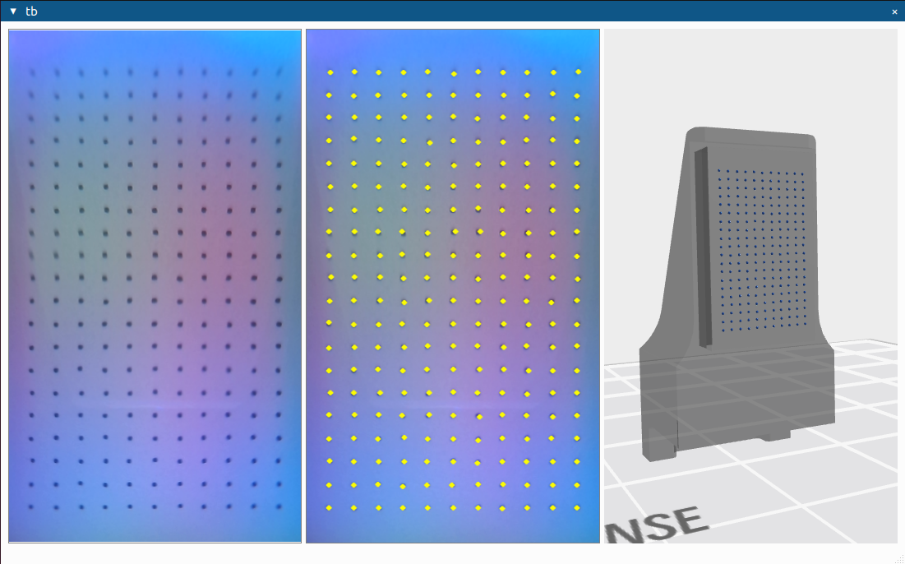

<a id="example-finger-depth"></a>
### 11.3 example_finger_depth.py
```
python ~/xensesdk/Examples/example_finger_depth.py
```
<details>
<summary>output</summary>

```
Found Xense devices: {'OG000165': 0}
new flash read fail, fallback.
new flash read fail, fallback.
new flash read fail, fallback.
new flash read fail, fallback.
Read config from OG000165: cam_id_0 success!
In SDK: [Network] Camera 0 connected
Init infer engine
infer session using GPU
```

</details>

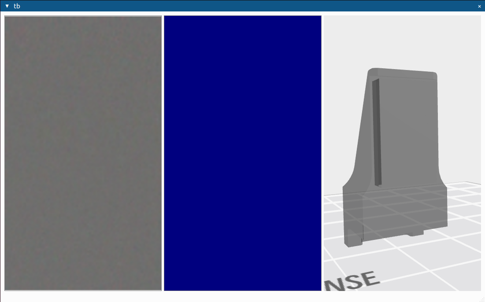

<a id="example-depth"></a>
### 11.4 example_depth.py
```
python ~/xensesdk/Examples/example_depth.py
```
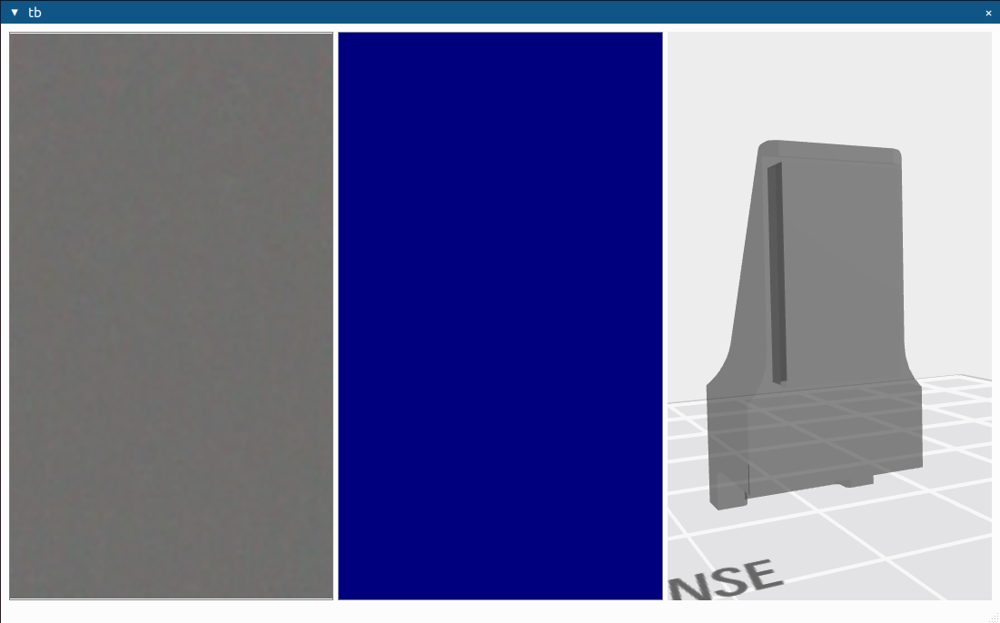

<details>
<summary>output</summary>

```
Found Xense devices: {'OG000165': 0}
new flash read fail, fallback.
new flash read fail, fallback.
new flash read fail, fallback.
new flash read fail, fallback.
Read config from OG000165: cam_id_0 success!
In SDK: [Network] Camera 0 connected
Init infer engine
infer session using GPU
```

</details>

<a id="api-instruction"></a>
## 12. API instruction
<a id="api-create"></a>
### 12.1 `create` 方法

##### 描述

创建一个传感器实例，在结束时请调用`release`。

##### 输入参数

* **cam\_id** (`int | str`, 可选): 传感器 ID、序列号或视频路径。默认为 0。
* **use\_gpu** (`bool`, 可选): 是否使用 GPU 推理，默认为 True。
* **config\_path** (`str | Path`, 可选): 配置文件路径或目录。如果是目录，需包含与传感器序列号同名的标定文件。
* **api** (`Enum`, 可选): 相机 API 类型（如 OpenCV 后端），用于指定相机访问方式。
* **check\_serial** (`bool`, 可选): 是否检查传感器序列号，默认 True。
* **rectify\_size** (`tuple[int, int]`, 可选): 校正图像尺寸。
* **ip\_address** (`str`, 可选): 远程连接使用的相机 IP。
* **video\_path** (`str`, 可选): 离线模拟的视频路径。

##### 返回

* `Sensor` 对象

##### 示例

```python

# Example 1：  用SN码开启
from xensesdk import Sensor
sensor = Sensor.create('OP000064') 

# Example 2：  用相机编号开启
sensor = Sensor.create(0) 

# Example 3： 打开储存的数据
sensor = Sensor.create(None, video_path=r"data.h5")

# Example 4： 打开算力板上的传感器
sensor =  Sensor.create('OP000064', ip_address="192.168.66.66")
```

---

<a id="api-selectsensorinfo"></a>
### 12.2 `selectSensorInfo` 方法

##### 描述

获取指定类型的传感器数据。

##### 输入参数

* **args**: 任意数量的 `Sensor.OutputType` 枚举，用于指定需要获取的数据类型：

    * Rectify: Optional[np.ndarray]          # 校正图像, shape=(700, 400, 3), RGB
    * Difference: Optional[np.ndarray]       # 差分图像, shape=(700, 400, 3), RGB
    * Depth: Optional[np.ndarray]            # 深度图像, shape=(700, 400), 单位mm

    * Marker2D: Optional[np.ndarray]         # 切向位移, shape=(35, 20, 2)
    * Force: Optional[np.ndarray]            # 三维力分布, shape=(35, 20, 3)
    * ForceNorm: Optional[np.ndarray]        # 法向力分量, shape=(35, 20, 3)
    * ForceResultant: Optional[np.ndarray]   # 六维合力, shape=(6,)

    * Mesh3D: Optional[np.ndarray]           # 当前帧3D网格, shape=(35, 20, 3)
    * Mesh3DInit: Optional[np.ndarray]       # 初始3D网格, shape=(35, 20, 3)
    * Mesh3DFlow: Optional[np.ndarray]       # 网格形变向量, shape=(35, 20, 3)

##### 返回

* 所请求的传感器数据（返回数量和顺序与参数一致）

##### 示例

```python
from xensesdk import Sensor
sensor = Sensor.create('OP000064') 
rectify, marker3d, marker3dInit, marker3dFlow, depth = sensor.selectSensorInfo(
    Sensor.OutputType.Rectify, 
    Sensor.OutputType.Marker3D, 
    Sensor.OutputType.Marker3DInit,
    Sensor.OutputType.Marker3DFlow,
    Sensor.OutputType.Depth
)
...
sensor.release()
```

---

<a id="api-startsavesensorinfo"></a>
### 12.3 `startSaveSensorInfo` 方法

##### 描述

开始保存指定类型的传感器数据，在结束时务必搭配`stopSaveSensorInfo`使用。

##### 输入参数

* **path** (`str`): 数据保存的文件夹路径。
* **data\_to\_save** (`List[Sensor.OutputType]`, 可选): 需要保存的数据类型列表。为 `None` 则保存所有类型。

##### 返回

* 无

##### 示例

```python
from xensesdk import Sensor
sensor = Sensor.create('OP000064') 
data_to_save = [
    Sensor.OutputType.Rectify, 
    Sensor.OutputType.Difference,
    Sensor.OutputType.Depth,
    Sensor.OutputType.Marker2D
]
sensor.startSaveSensorInfo('/path/to/save', data_to_save)
...
sensor.stopSaveSensorInfo()
...
sensor.release()
```

---

<a id="api-stopsavesensorinfo"></a>
### 12.4 `stopSaveSensorInfo` 方法

##### 描述

停止数据保存。

---

<a id="api-getcameraid"></a>
### 12.5 `getCameraID` 方法

##### 描述

获取当前传感器的相机编号。

---

<a id="api-resetreferenceimage"></a>
### 12.6 `resetReferenceImage` 方法

##### 描述

重置数据处理流程。

---

<a id="api-release"></a>
### 12.7 `release` 方法

##### 描述

释放资源，关闭传感器。

---

<a id="faq"></a>
## 常见问题解答 (FAQ)

**问：** 无法加载 Qt 平台插件 "xcb" 虽然它已被找到，错误信息为 "..."

**答：** 进入 `.../site-packages/.../Qt/plugins/platform` 目录并删除 `libqxcb.so` 文件。

**问：** from 6.5.0, xcb-cursor0 or libxcb-cursor0 is needed to load the Qt xcb platform plugin.
Could not load the Qt platform plugin "xcb" in "" even though it was found. This application failed to start because no Qt platform plugin could be initialized. Reinstalling the application may fix this problem.

**答：** 终端内执行：

```shelll
sudo apt-get update
sudo apt-get install libxcb-cursor0
```
